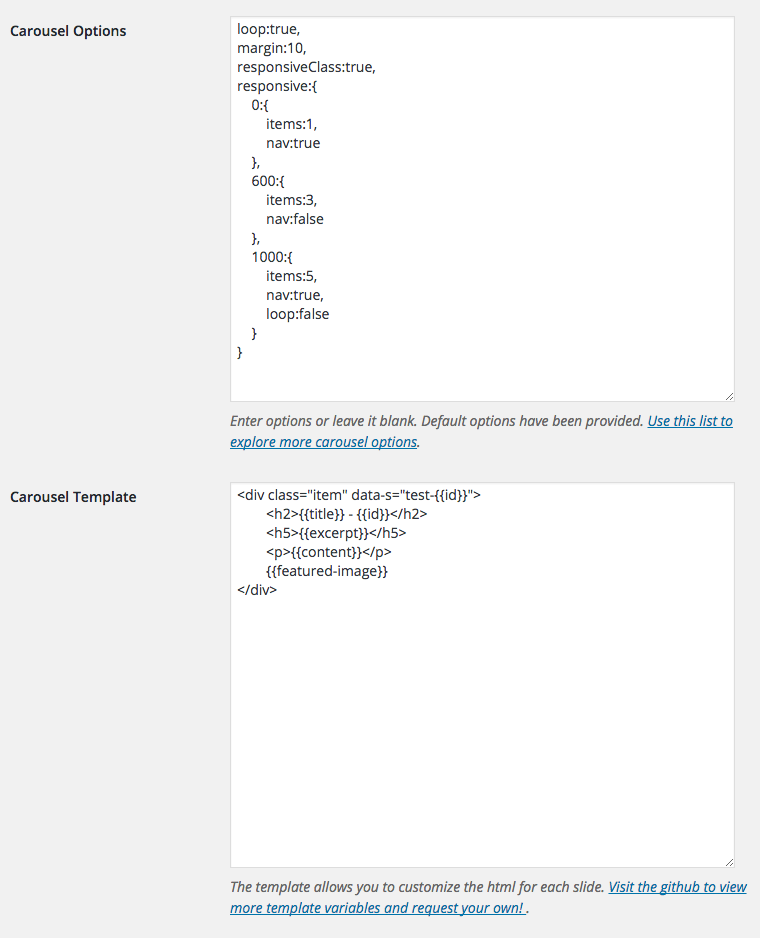

# Night-Carousel-Plus
### A WordPress Plugin using the Owl Carousel jQuery Plugin
#### By Matt Vona

---

[Owl Carousel](https://github.com/OwlCarousel2/OwlCarousel2) is a simple jQuery slider that lets you create a beautiful, responsive carousel slider. This WordPress plugin comes with functionality that will allow you to add a slide easily anywhere, each with custom settings.

## Shortcode
The shortcode currently has 1 argument that is necessary for it to function correctly:
- `carousel` Slug of carousel you want to appear.

Example:
`[night-carousel-plus carousel="home"]`

## Carousel Options
Night Carousel has many [options you can see here](https://owlcarousel2.github.io/OwlCarousel2/docs/api-options.html).

Visit here for the official [Night Carousel Plugin page](https://wordpress.org/plugins/night-carousel-plus/).

## Template
Night Carousel Plus comes with a way to edit the output of each slide. The HTML can be customized exactly how you want it! The template field uses a system of variables to help with editing:

- `{{title}}` The title of the slide.
- `{{content}}` The content of the slide.
- `{{excerpt}}` The excerpt of the slide.
- `{{id}}` The Post ID of the slide.
- `{{featured-image}}` Returns the URL of the featured image.

## Screenshot:

## To-Do:
- Fix bug that adds slashes before quotes in carousel template
- Adjust query ordering or allow for custom ordering of some kind
- Feel free to submit ideas!

#### v1.1.4 
- Fixed bug that displayed PHP notice when carousel did not exist. 

v1.1.3
- Changed name for WordPress Plugin manager
- updated bug that showed notice if the carousel did not exist

v1.1.2
- Fixed a bug that caused the content of the current page to be displayed instead of the post. 
- Optimized performance by sending post object instead of doing db checks or wp default get functions.
- Fixed a small bug that add a slash in quotes which would ruin html classes 

v1.1.1
- Implemented Featured-image to work in the template.

v1.1.0
- Added more template options.

v1.0.0
- Initial

Initial release, I hope to add more features soon!
Feel free to contact me with any requests or issues!

This plugin currently uses Owl Carousel v2.1.0 